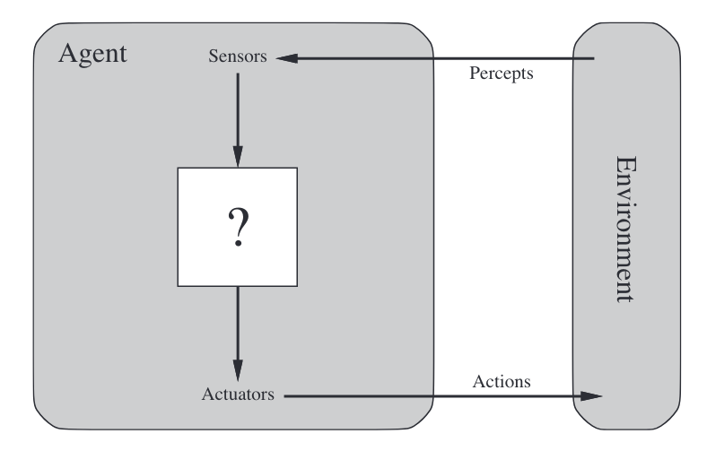

# Introducción a la Inteligencia Artificial (IA)

## ¿Qué es la Inteligencia Artificial?
La Inteligencia Artificial (IA) es el campo dedicado al desarrollo de agentes racionales que, al interactuar con un entorno, buscan maximizar la utilidad futura esperada. Algunas características clave incluyen:

- **Actuar racionalmente**: Tomar decisiones óptimas con base en mediciones disponibles.
- **Interacción con el entorno**: Percibir información (sensores) y realizar acciones (actuadores).
- **Exploración y aprendizaje**: Adaptarse y mejorar continuamente.

### Enfoques para definir IA
1. **Similitud con humanos**: Pensar o actuar como humanos.
2. **Racionalidad**: Pensar o actuar de manera lógica y óptima.

### Historia breve de la IA
1. **Gestación y nacimiento (1943-1956)**: Primeros modelos computacionales de la inteligencia.
2. **Sistemas basados en conocimiento (1969-1979)**: Uso intensivo de reglas y bases de datos.
3. **Regreso de las redes neuronales (1986-)**: Crecimiento del aprendizaje profundo.
4. **Agentes inteligentes y Big Data (1995-)**: Modelos adaptativos en entornos complejos.

---

# Introducción a los Agentes Inteligentes

## ¿Qué es un agente?
Un **agente** es una entidad que percibe su entorno mediante sensores y actúa sobre él mediante actuadores. Ejemplos incluyen humanos, robots, aplicaciones de software y dispositivos simples como termostatos.

### Función del agente
La **función del agente** (AgentFn) mapea las percepciones históricas a acciones:
\[
f : P^* \to A
\]
Donde \(P^*\) son percepciones acumuladas y \(A\) es el conjunto de acciones posibles.

## Tipos de agentes
1. **Agentes de reflejo simple**:
   - Basados en reglas de condición-acción.
   - Ejemplo: Agente aspiradora que limpia cuando detecta suciedad.

2. **Agentes con estado interno**:
   - Modelan cómo evoluciona el entorno y sus propias acciones.

3. **Agentes basados en objetivos**:
   - Seleccionan acciones para alcanzar metas específicas.

4. **Agentes basados en utilidad**:
   - Escogen acciones para maximizar una función de utilidad.

5. **Agentes de aprendizaje**:
   - Incorporan un elemento de aprendizaje que mejora su rendimiento basado en retroalimentación.

## Racionalidad y entornos
Un agente racional busca maximizar una medida de desempeño considerando:
- Percepciones disponibles (racional ≠ omnisciente).
- Resultados de acciones inciertos (racional ≠ clarividente).
- Información del entorno incompleta (racional implica explorar y aprender).

### Clasificación de entornos
1. **Observabilidad**: Total o parcial.
2. **Dinámica**: Estático o dinámico.
3. **Determinismo**: Determinista o estocástico.
4. **Agentes involucrados**: Uno o múltiples agentes.

