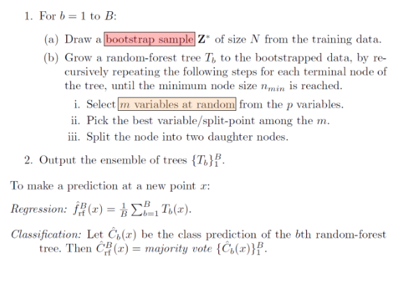

# Aprendizaje Máquina  

## Motivación  

Es muy difícil escribir programas que resuelvan problemas complejos, como:  

- Reconocer objetos en 3D desde diferentes perspectivas y condiciones de luz.  
- Calcular la probabilidad de que una transacción en línea sea fraudulenta.  

Las dificultades principales son:  

1. **Falta de conocimiento explícito:** No sabemos exactamente cómo procesa nuestro cerebro este tipo de información.  
2. **Complejidad del código:** Aunque supiéramos cómo hacerlo, el programa resultante sería extremadamente complejo.  
3. **Reglas insuficientes:** No hay reglas simples y confiables para ciertos problemas. Se requiere una gran cantidad de reglas, y aún así, estas deben actualizarse constantemente debido a la naturaleza dinámica del problema.  

## La Solución  

En lugar de escribir programas específicos para cada tarea, podemos:  

1. **Recolectar datos:** Obtener muchos ejemplos que representen la respuesta correcta en cada caso.  
2. **Utilizar un algoritmo de aprendizaje automático:** Este tomará los datos y generará un programa basado en ellos.  
3. **Obtener un programa flexible:** A diferencia de un programa escrito a mano, este programa puede:  
   - Generalizar a nuevos casos con cierto margen de confianza.  
   - Adaptarse cuando los datos cambian.  

### Ventajas  

- El acceso a **grandes volúmenes de datos** y **potencia computacional masiva** ha reducido los costos en comparación con contratar expertos en tareas específicas.  

## Definición  

Existen varias definiciones que nos ayudan a comprender el aprendizaje automático:  

### Arthur Samuel (1959)  
> **"Machine Learning is the field of study that gives computers the ability to learn without being explicitly programmed."**  

Samuel introduce el concepto de que una computadora puede aprender a partir de datos sin que un programador le indique cada paso explícitamente.  

### Tom Mitchell (1998)  
> **"A computer program is said to learn from experience (E) with respect to some task (T) and some performance measure (P), if its performance on T, as measured by P, improves with experience E."**  

Mitchell proporciona una definición más formal, donde el aprendizaje ocurre cuando el desempeño de un programa mejora a medida que obtiene más experiencia en una tarea específica.

## Generalización  

 

---

## Método del Vecino Más Próximo (K-Nearest Neighbors, KNN)  

1. **No paramétrico**:  
   Este método no supone ninguna forma funcional específica para los datos.  

2. **Requiere almacenar los datos del conjunto de entrenamiento**:  
   Todos los datos deben mantenerse en memoria para realizar predicciones.  

3. **Mide la similitud**:  
   Se calcula una medida de similitud (como la distancia euclidiana) entre el dato desconocido y cada uno de los datos del conjunto de entrenamiento.  

4. **Predicción**:  
   La clase del dato desconocido se asigna según la clase del dato más cercano.  

5. **Simplicidad**:  
   Es un método conceptualmente simple, ideal para comprender cómo funciona la clasificación basada en la proximidad.  

## Metodos de aprendizaje maquina:
- Modelos descriptivos
- Modelos lineales generalizados
- Arboles de decision
- Redes neuronales
- Metodos de ensemble

## Generalización en el Aprendizaje Supervisado

### Problema de optimizacion
El aprendizaje supervisado se puede plantear como un problema de optimización, donde se busca encontrar un vector de parámetros *theta* que minimice la diferencia entre el error en muestra y el error fuera de muestra.

### Desigualdad de Hoeffding
La desigualdad de Hoeffding acota la probabilidad de que la diferencia entre el error en muestra (E_in) y el error fuera de muestra (E_out​) sea grande. 

### Clasificación Binaria y el Número de Hipótesis

- En un problema de clasificación binaria, las hipótesis pueden clasificarse en dicotomías.
- Función de crecimiento: Define cuántas dicotomías diferentes pueden generarse con un conjunto de datos dado.

### Dimensión VC (Vapnik-Chervonenkis)

- La dimensión VC (d_VC) es el tamaño máximo de un conjunto de puntos que puede ser completamente separado por un modelo.
- Si d_VC es finito, el aprendizaje es posible dado un número suficiente de datos de entrenamiento.

### ¿Cuántos datos se necesitan para generalizar?

El número de datos necesarios depende de:
- La complejidad del modelo (d_VC).
- La precisión deseada.
- La probabilidad de error aceptable.

### Regla de Oro para la Generalización

En resumen, el aprendizaje es posible si:
- Se elige un modelo con d_VC​ adecuado.
- Se cuenta con suficientes datos de entrenamiento para satisfacer las desigualdades clave.

# Arboles de decision

## Espacio de hipotesis
Los árboles de decisión son un tipo de hipótesis donde cada nodo interno prueba un atributo xᵢ
- Hay una rama para cada valor de atributo posible xᵢ=v
- Cada hoja asigna una clase y
- Para clasificar la entrada x, se recorre el árbol desde la raíz hasta la hoja y se emite la y etiquetada.

Los árboles de decisión pueden expresar cualquier función de los atributos de entrada discretos y, en el caso de entradas y salidas continuas, pueden aproximar cualquier función arbitrariamente.
Sin embargo, un árbol de decisión consistente para cualquier conjunto de entrenamiento con una ruta a la hoja para cada ejemplo probablemente no se generalizará a nuevos ejemplos. Por lo tanto, se requiere algún tipo de regularización para garantizar árboles de decisión más compactos.

## NP-*completo*
El aprendizaje del árbol de decisión más simple es un problema NP-completo. Debido a esto, se recurre a una heurística greedy que comienza con un árbol de decisión vacío.
- Se divide en el siguiente mejor atributo (característica)
- Se repite el proceso de forma recursiva

## Entropia
La entropía H(Y) es la incertidumbre de una variable aleatoria Y. Cuanta más incertidumbre, más entropía.

- Desde la perspectiva de la teoría de la información, H(Y) es el número esperado de bits necesarios para codificar un valor de Y extraído aleatoriamente (bajo el código más eficiente)

- Una distribución uniforme se considera de "alta entropía" porque los valores muestreados de ella son menos predecibles
  
- Una distribución variada (con picos y valles) se considera de "baja entropía" porque los valores muestreados de ella son más predecibles

Después de la división, una buena división es aquella en la que existe mayor certeza sobre la clasificación

La entropía condicional H(Y|X) es la entropía de una variable aleatoria Y condicionada a una variable aleatoria X.

La ganancia de información es la disminución de la entropía (incertidumbre) después de la división.

## Aspectos a considerar
Casos base para detener la división:
- No dividir un nodo si todos los registros coincidentes tienen el mismo valor de salida

- No dividir un nodo si los puntos de datos son idénticos en los atributos restantes

- No es recomendable no hacer recursión si todos los atributos tienen una pequeña ganancia de información

Árboles de decisión y overfitting:

- Los árboles de decisión estándar no tienen un sesgo de aprendizaje, lo que puede llevar a un error cero en el conjunto de entrenamiento si no hay ruido en las etiquetas

- Esto puede resultar en mucha varianza, por lo que es importante introducir algún sesgo hacia árboles más simples

- Las estrategias para seleccionar árboles más simples incluyen profundidad fija, número mínimo de muestras por hoja y el uso de random forests

Entradas de valor real:

- Para entradas de valor real, se utilizan divisiones de umbral en árboles binarios, dividiendo en el atributo X en el valor t

- Una rama representa X < t, y la otra representa X ≥ t

- Es importante buscar a través de los posibles valores de t, pero solo un número finito de t son importantes

- Se deben considerar los puntos de división de la forma xi + (xi+1 – xi)/2, y solo las divisiones entre ejemplos de diferentes clases importan

- Para seleccionar el mejor umbral, se utiliza la ganancia de información IG(Y | X:t) para Y al probar si X es mayor o menor que t

- Se define H(Y|X:t) = p(X < t) H(Y|X < t) + p(X >= t) H(Y|X >= t) e IG(Y|X:t) = H(Y) - H(Y|X:t), y se usa IG*(Y|X) = maxt IG(Y|X:t) para variables continuas.
  
## Ensamble learning:

- El bagging implica tomar muestras bootstrap repetidas del conjunto de entrenamiento D

- Se crean k muestras bootstrap D1 … Dk, se entrena un clasificador distinto en cada Di y se clasifica la nueva instancia por voto mayoritario o promedio

- Los random forests son un método de ensamble diseñado específicamente para clasificadores de árboles de decisión que introducen aleatoriedad a través de bagging y vectores de entrada aleatorios
- En cada nodo, la mejor división se elige de una muestra aleatoria de m atributos en lugar de todos los atributos.

## Algoritmo para bosques aleatorios
